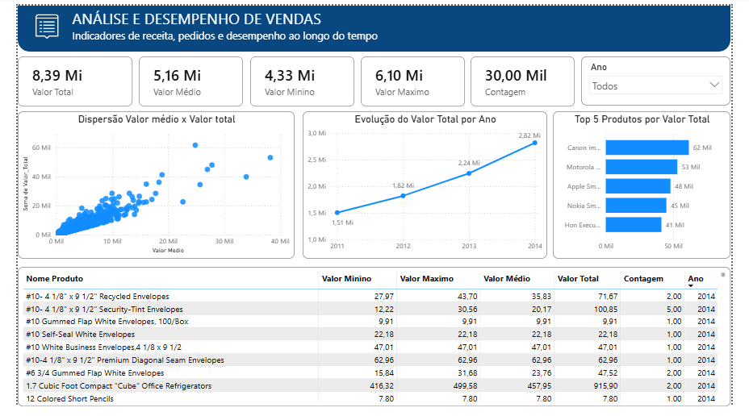
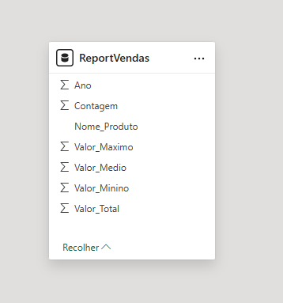
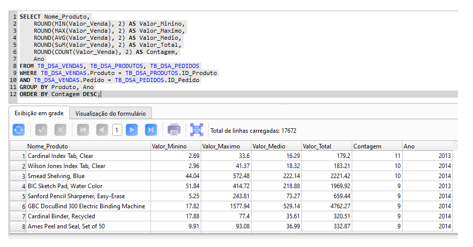

# 📊 Análise de Desempenho de Vendas com SQL e Power BI

## 📌 Sobre o Projeto

Dashboard desenvolvido no Power BI com o objetivo de analisar o desempenho de vendas, permitindo uma visão consolidada dos principais indicadores comerciais e sua evolução ao longo do tempo.

O projeto utiliza SQL para consulta e preparação dos dados e Power BI para modelagem, criação de medidas e visualização dos indicadores.

---

## 🎯 Objetivo

Desenvolver uma solução de análise de vendas capaz de apresentar uma visão clara dos principais indicadores comerciais e facilitar a identificação de tendências e variações no desempenho.

O dashboard permite analisar os resultados de forma dinâmica, utilizando filtros para explorar diferentes períodos.

---

## 📊 Principais Indicadores

O dashboard apresenta indicadores relacionados ao desempenho das vendas, permitindo acompanhar:

* 💰 Receita
* 🛒 Pedidos
* 👥 Clientes
* 📈 Evolução das vendas
* 📊 Desempenho ao longo do tempo
* 📅 Análise por período

---

## 🛠️ Tecnologias Utilizadas

* **SQL** — consulta e análise dos dados
* **Power BI** — criação do dashboard e visualizações
* **DAX** — criação de medidas e indicadores
* **GitHub** — versionamento e documentação do projeto

---

## 🔎 Análises Realizadas

A análise permite visualizar e acompanhar:

* Evolução da receita ao longo do tempo;
* Volume de pedidos;
* Desempenho das vendas por período;
* Comportamento dos principais indicadores;
* Identificação de períodos de maior e menor desempenho.

---

## 🧮 SQL

O SQL foi utilizado como parte fundamental do processo de análise, permitindo realizar consultas, agregações e organização dos dados antes da construção das visualizações no Power BI.

Entre os conceitos utilizados estão:

* `SELECT`
* `WHERE`
* `GROUP BY`
* Funções de agregação
* Ordenação e análise dos resultados
* Consultas para obtenção dos indicadores utilizados no dashboard

---

## 📊 Power BI

No Power BI foram desenvolvidos:

* Indicadores (KPIs);
* Gráficos para análise temporal;
* Filtros interativos;
* Cartões de múltiplas linhas;
* Elementos visuais para facilitar a interpretação dos dados;
* Layout focado em organização e legibilidade.

---

## 📚 Aprendizados

Este projeto contribuiu para o desenvolvimento prático de conhecimentos em:

* Análise de dados com SQL;
* Construção de consultas analíticas;
* Agregação e exploração de dados;
* Criação de indicadores;
* Visualização de dados;
* Desenvolvimento de dashboards no Power BI;
* Organização e apresentação de informações para análise.


---

## 📈 Dashboard

### Análise de Desempenho de Vendas



### Modelo



### Consulta SQL




---

## 📂 Estrutura do Repositório

```text
📁 Dashboard-SQL-PowerBI/
│
├── 📊 Dashboard.pbix
├── 📄 README.md
├── 📄 Banco.db
│
└── 📁 screenshots/
    └── 🖼️ dashboard.png
    └── 🖼️ modelagem.png
    └── 🖼️ consulta.png
```

---

## 👨‍💻 Autor

**José Rafael Santos Pereira**


Desenvolvendo projetos práticos | Power BI | SQL | Python | Business Intelligence

GitHub: https://github.com/ZeRafaSp/

LinkedIn: https://www.linkedin.com/in/rafaelsantospereirarsp/
